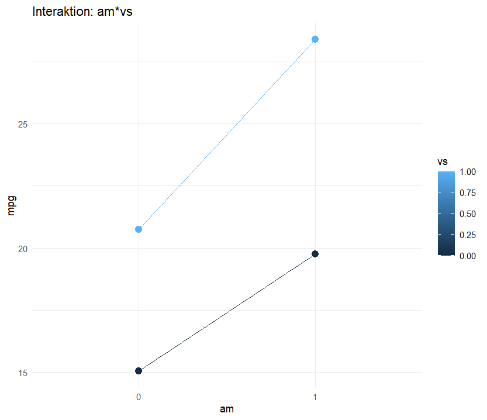
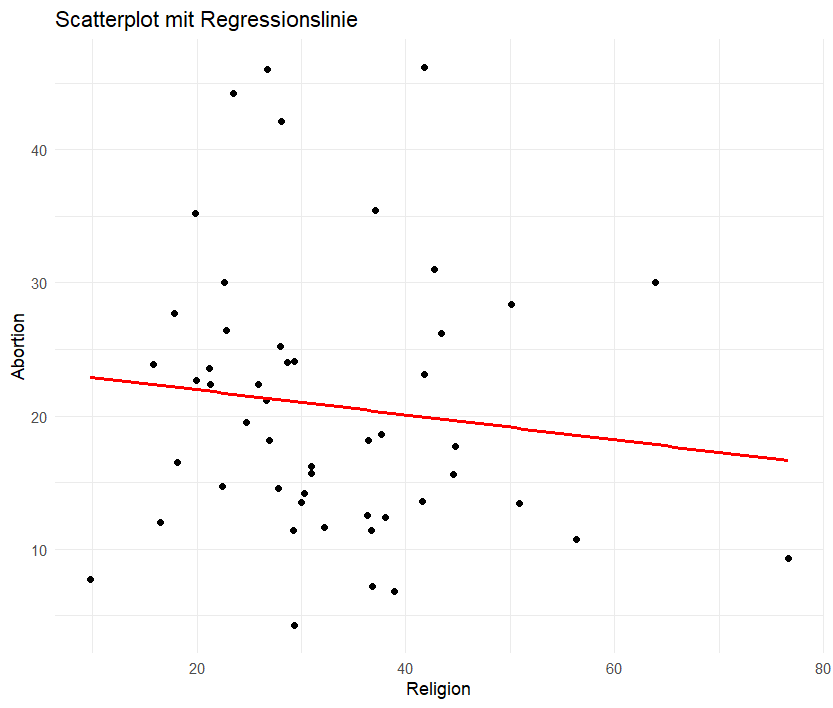
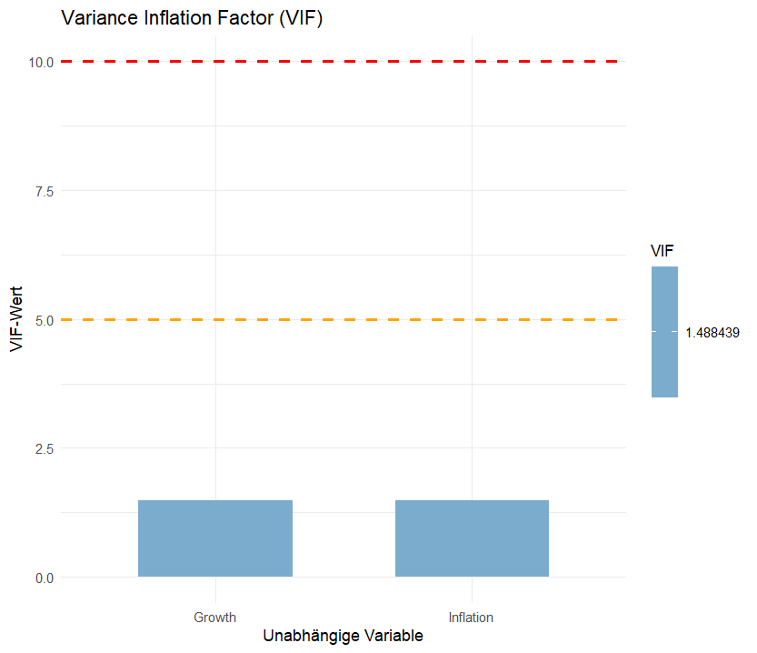

# R_Regression_Tools - Statistical Analysis Functions in R

This repository contains modular R functions for automated statistical analysis, including:

Simple and multiple linear regression

ANOVA and Kruskal-Wallis tests

An example script demonstrating how to apply the included functions

All scripts are well-documented and structured to support data analysis projects and technical applications.

## Features

### Simple Linear Regression with:

Regression line, residual plots, Q-Q plot

Shapiro-Wilk test for normality

### Multiple Linear Regression with:

VIF-based multicollinearity check

Correlation matrix

Homoskedasticity test (Breusch-Pagan)

Residual plots and coefficient diagnostics

### Regression with Interactions:

Interaction plots (numeric × factor, factor × factor, numeric × numeric)

Johnson-Neyman intervals

Confidence intervals for coefficients

### ANOVA/Kruskal-Wallis:

Automatic test selection based on normality and variance homogeneity

Tukey / Dunn / Games-Howell post-hoc tests

Error bars, boxplots, and simultaneous confidence intervals

## Example Outputs

Below are example plots generated by the regression functions:

### Interaction Plot

### Regression Plot

### VIF Plot

## Author

Aurélio Nwamusse  
[GitHub Profile](https://github.com/aurelionw)

## Disclaimer

This tool is intended for educational use only. Please verify results in academic or professional contexts.
